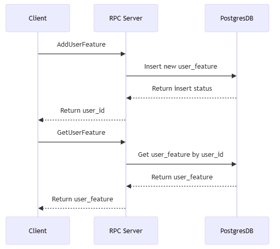

#  A gRPC Web Server with User Feature Database Integration
- [A gRPC Web Server with User Feature Database Integration](#a-grpc-web-server-with-user-feature-database-integration)
  - [High level design](#high-level-design)
    - [Dockerize and testing](#dockerize-and-testing)
    - [Go client flow](#go-client-flow)
  - [Setup development environment](#setup-development-environment)
  - [How to run](#how-to-run)
- [Testing using portman](#testing-using-portman)
  - [Invoking a unary method](#invoking-a-unary-method)
    - [Click new, choice gRPC](#click-new-choice-grpc)
    - [Choice import a proto file](#choice-import-a-proto-file)
    - [Using this file to import:](#using-this-file-to-import)
    - [After import, we can invoking writing (AddUserFeature)](#after-import-we-can-invoking-writing-adduserfeature)
    - [And reading (GetFeature) operations](#and-reading-getfeature-operations)

## High level design

Base on requirement, I have 2 optional to use Go or Java to build application

| Aspect                   | Golang                                           | Java                                                   |
| ------------------------ | ------------------------------------------------ | ------------------------------------------------------ |
| **Language**             | Simplicity, Docker-friendly.                     | Versatile, strong ecosystem, potential learning curve. |
| **gRPC Support**         | Excellent support, native async with goroutines. | Strong support, various libraries, multithreading.     |
| **Protobuf Integration** | Native support, concise definitions.             | Solid support, plugins, aligns well with OOP.          |
| **Database Integration** | Variety of drivers, simplicity.                  | Extensive support via JDBC, ORM frameworks.            |
| **Dockerization**        | Statically linked binaries, lightweight images.  | Requires Java runtime, larger images, JLink option.    |
| **Error Handling**       | Explicit return values, clear.                   | Exceptions, more verbose, structured error handling.   |

For a simple demo app, I prefer to use golang for clear error handling, focus on implement RPC server logic and less effort than implement using Java

Also the requirement is clear data schema so I use PostgreSQL

### Dockerize and testing 


### Go client flow


## Setup development environment

- Install `protoc`:

```bash
brew install protobuf
```

- Install `protoc-gen-go` and `protoc-gen-go-grpc`

```bash
go get google.golang.org/protobuf/cmd/protoc-gen-go
go get google.golang.org/grpc/cmd/protoc-gen-go-grpc
```

- Install `protoc-gen-grpc-gateway`

```bash
go get github.com/grpc-ecosystem/grpc-gateway/v2/protoc-gen-grpc-gateway
```

## How to run

- Generate codes from proto files:

```bash
make gen
```

- Start the development environment
```bash
make dev-up
```

- Run server and client:
```bash
make server
make client
```

- Build docker image
```
make build
```

- Running the Docker container application
```
make test-up
```

# Testing using portman

After run the Docker container application command:

```
make test-up
```

We can test reading (GetFeature) and writing (AddUserFeature) operations to a database via gRPC

## Invoking a unary method

### Click new, choice gRPC


### Choice import a proto file


### Using this file to import: 


### After import, we can invoking writing (AddUserFeature)


### And reading (GetFeature) operations

